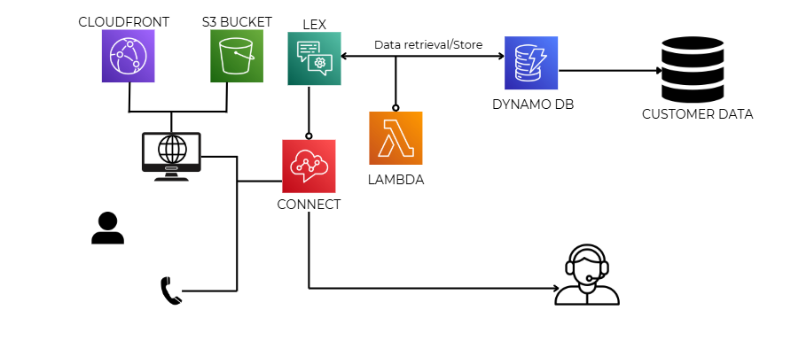

# Conversational IVR using AWS

## Project Overview
The **Conversational IVR using AWS** project automates customer care interactions by handling routine queries through an Interactive Voice Response (IVR) system. The system intelligently identifies urgent or complex queries and escalates them to a human agent, improving efficiency and customer satisfaction.

## Features
- **Automated Query Handling**: Uses AWS services to manage routine customer queries.
- **Urgent Query Identification**: Automatically identifies urgent issues and routes them to a human agent.
- **Scalable Solution**: Built with AWS to easily scale as customer query volume increases.
- **Seamless Integration**: Can be integrated with existing customer care systems.
- **User Data Management**: Stores and retrieves user data using **Amazon DynamoDB**.
- **Web Deployment**: Deployed via an **AWS S3 bucket** for easy access through a web interface.

## Workflow

*This image illustrates the workflow of the IVR system, integrating AWS services like Lex, Lambda, DynamoDB, S3, and Connect for automated and human-assisted query resolution.*

## Technologies Used
- **AWS Lex**: For building the conversational interface.
- **AWS Lambda**: For executing business logic.
- **Amazon Connect**: For call routing and management.
- **AWS Polly**: For text-to-speech conversion.
- **Amazon DynamoDB**: For storing and retrieving user data.
- **Amazon S3**: For deploying the web interface and managing static assets.
